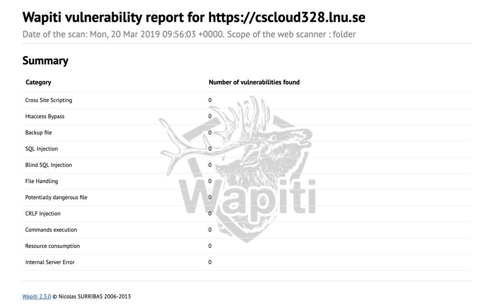

# GitIssues

## What is the URL to your application?

https://cscloud328.lnu.se

## Förklara vad du har gjort för att göra appen säker, både i din kod och när du konfigurerat servern

### Kodmässigt:

Jag har installerat och använt mig av modulen Helmet som sätter olika headers som säkrar upp applikationen. Som standard hjälper denna modul mig med att:

* DNS Prefetch Control - inaktiverar webbläsarens prefetch (DNS-förhämtning), alltså att webbläsaren inte översätter länkars domännamn till en IP-adress förrän den är klickad på.
  
* Frameguard - förhindrar "clickjacking" så att användaren inte oavsiktligt trycker på en något som den inte vill klicka på, vilket kan resultera i att man hamnar på en extern webbplats. Kan användas för att få användaren att besöka en sida som genererar annonsintäkter.

* Hide Powered-by: döljer vilken plattform servern körs på. Om en server kör på Express kan denna dölja denna information.

* Strict-Transport-Security - Förhindrar att anslutningen går från HTTPS till HTTP. HTTP är okrypterad trafik där känslig data kan läcka.

* IE Not Open - Förhindrar Internet Explorer (upp till version 8) att exekvera HTML-sidor på en webbplats (exempelvis genom att ladda upp ett HTML-dokument).

* Don't Sniff Mimetype - Förhindrar webbläsare att gissa mimetypen på ett dokument. En server kan annars skicka en felaktig mimetyp (text/html) samtidigt som den kan innehålla JavaScript som riskerar att exekveras.

* XSS Filter - Förhindrar exekvering av JavaScript som bland annat kan skickas in via formulärfält. Helmet säkrar delvis upp detta genom att inte ta emot data som innehåller skripttaggar.

Utöver ovanstående så kan man konfigurera Content Security Policy som hjälper till att förhindra att filer (bilder, html-dokument, javascript etc.) laddas in från andra källor än sitt eget domännamn. I mitt fall så har jag följande uppsättning:

* CSS: Tillåts från mitt eget domännamn samt Cloudflare.

* Skript: Tillåts från mitt eget domännamn och Cloudflare samt Font Awesome.

* upgradeInsecureRequests: aktiverad. Skickar en header till servern som ber om att anslutningen ska gå över HTTPS.

* blockAllMixedContent: förhindrar innehåll som laddas över HTTP att exekveras

Borsett från Helmet så har jag implementerat en modul som kontrollerar att POST-anrop till servern kommer från GitHub. Detta genom att avläsa SHA-signaturen som GitHub skickar vid sin POST och jämför den med den SHA-signatur jag implementerat på servern.

### På servern:

* Installerat SSL-certifikat från Let's Encrypt
* Dolt Powered-by headern genom att sätta "server_tokens off". Tack vare det kan man inte avläsa att Ubuntu körs på servern utan enbart nginx.
* Aktiverat den inbyggda brandväggen i Ubuntu och endast tillåtit anslutningar över SSH, HTTP och HTTPS. Detta gör att vår server som är bakom vår reversed proxy inte kan kommas åt utifrån eftersom anslutningar endast tillåts på port 80, 443 och 22.
* Installerat och kört verktyget Wapiti som kontrollerar om det finns några säkerhetshål. Wapiti kan bland annat upptäcka följande sårbarheter:
	* SQL-injektioner
	* XSS
	* Svaga .htaccess konfigurationer

[Länk till Wapiti](http://wapiti.sourceforge.net/)

## Förklara nedanstående, hur du har använt dem och vad deras syfte är i din lösning:

* Reversed proxy - En sorts proxyserver bakom brandväggen som skickar klienter till den mest passande servern (om det finns flera). 
	* Kan med fördel användas för att avlasta en belastad server för att sedan dirigera nästkommande trafik till en server som inte är lika belastad. Detsamma gäller för om en server skulle släckas, då dirigeras trafiken till annan server som är uppe.
	* Ökar hastigheten genom att komprimera inkommande och utgående data samt cacha innehåll. 
	* SSL-kryptering för att avlasta webbservrarna (och således öka prestanda).
	* Ett utökat skydd mot säkerhetsattacker genom att den verkliga servern gömmer sig bakom webbservern.

I min applikation använder jag mig av en reversed proxy som jag installerat SSL-certifikatet på. Den reversed proxy kör på localhost, port 3000. Syftet är att öka säkerheten.

* Process manager - Används för att kunna starta om servern automatiskt om applikationen kraschar. Man kan även få information om runtime performance och resource consumption.

I min applikation använder jag mig av PM2 som process manager. PM2 kan starta om servern automatiskt utan nedtid och ger mig en överblick i processer som körs och hur mycket minne de förbrukar. Syftet är att servern ska kunna startas om efter varje ändring som görs på serversidan efter att jag pushat upp ändringar från GitHub.

* TLS certificates - Används för att kryptera trafiken (HTTPS) så att t.ex. användarnam och lösenord inte ska skickas i klartext. 

Jag använder mig av Let's Encrypt som ger mig en HTTPS anslutning samt att all trafik automatiskt vidarebefordras till https, även om man begärt att besöka webbplatsen med http.

* Environment variablar - används för att t.ex. sätta vilken port servern ska köras på och för att placera känslig information som privata nycklar (access tokens bl.a.) i. Environmentvariablar placeras i en .env fil som är dold och därmed inte publik på tjänster som GitHub. 

Jag använder mig av environmentvariablar för att placera min access token och signatur från GitHub. Syftet är att öka säkerheten så att denna känsliga information inte finns i min kod.

## Hur skiljer sig din app från i produktion till utveckling?

Under utveckling kan jag inte få live-uppdateringar för mina issues från GitHub eftersom webhooken är registrerad på domännamnet på servern. Därför går det endast att hämta issues men inte att få uppdateringar utan att ladda om sidan. Lokalt använder jag mig av NGROK som reversed proxy för att kunna arbeta effektivt och kunna testa webhooket mot den URL som NGROK genererar.

## Vilka extra moduler har du använt dig av? Motivera varför du valt att använda just dem och hur du har säkerställt att de är säkra nog för att sättas i produktion.

* Body Parser: används för att hämta data från GitHub i JSON-format.
* Dotenv: används för att kunna sätta egna environmentvariablar.
* Express: används för att ha en server körandes. 
* Express Handlebars: används för att kunna skapa templates, kunna återanvända sidhuvud och sidfot och applicera kod till html på ett enkelt sätt.
* Helmet: används för att öka säkerheten på servern (Express)
* Node-fetch: används för att kunna hämta data från GitHub
* Production: används för att kunna pusha upp ändringar till produktionsmiljön
* Socket.io: används för att öppna en websocket mellan servern och klienten och på så sätt få dem att kommunicera för att uppdatera HTML-dokument.
* Standard: används för att säkra att standard JavaScript-syntax efterföljs.
* Crypto: inbyggd modul i Node.js som används för att hasha signaturen som verifieras mot den signatur som skickas från GitHub.
* Wapiti: Verktyg för att upptäcka säkerhetshål.
* Nodemon - en dev-dependancy som endast används i utvecklingsmiljön för att servern ska startas om vid varje ändring i kod.

Anldeningen varför jag har valt att använda ovanstående moduler är för att de är populära, det finns mycket dokumentation kring dem för att underlätta utvecklingsprocessen samt för att upptäcka om det finns några kända säkerhetsrisker med dem. Jag har även kört "npm audit" för att upptäcka eventuella säkerhetshål men NPM har inte funnit några.

## Har du implementerat någon extra funktionalitet som kan motivera ett högre betyg?

Som utökad funktionalitet har jag gjort följande:

* Användaren kan växla mellan listvy och kolumnvy
* Användaren får notiser om det sker någon ändring bland issues. En notis kommer om ett nytt issue läggs till, om en issue blir stängd, får en ny kommentar eller om en issue återöppnas.
* Implementerat kod för alla issue-events, inte bara för nya issues.
* Användaren kan stänga ett issue direkt från klienten
* Vid ändring på ett befintligt issue så visas en separat CSS-stil på det element som uppdaterats. Exempelvis om en kommentar lagts till eller tagits bort. Om en ny issue dyker upp så får hela issue:t en unik bakgrundsfärg i tre sekunder innan den får samma stil som övriga issues.
* Eget SSL-certifikat via Let's Encrypt istället för egensignerat.